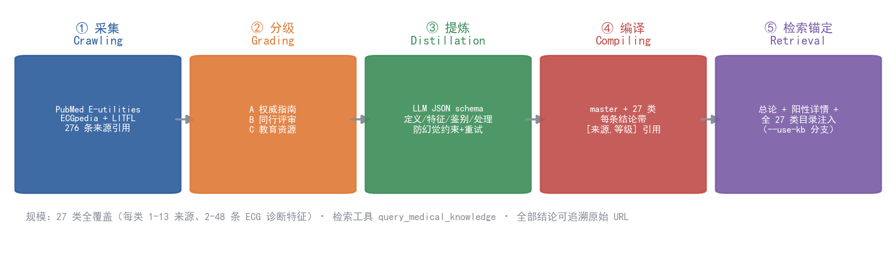
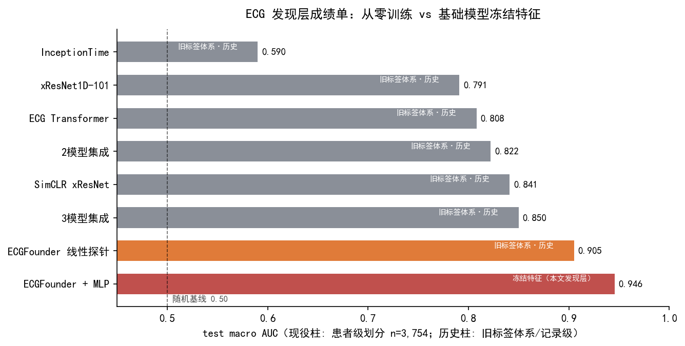
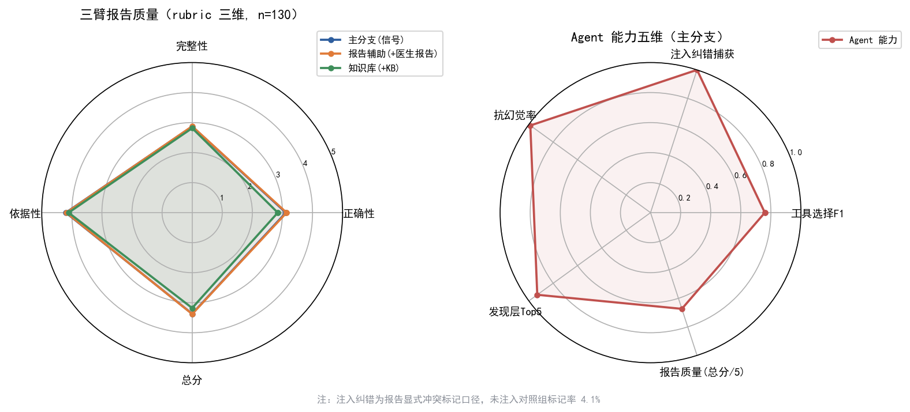
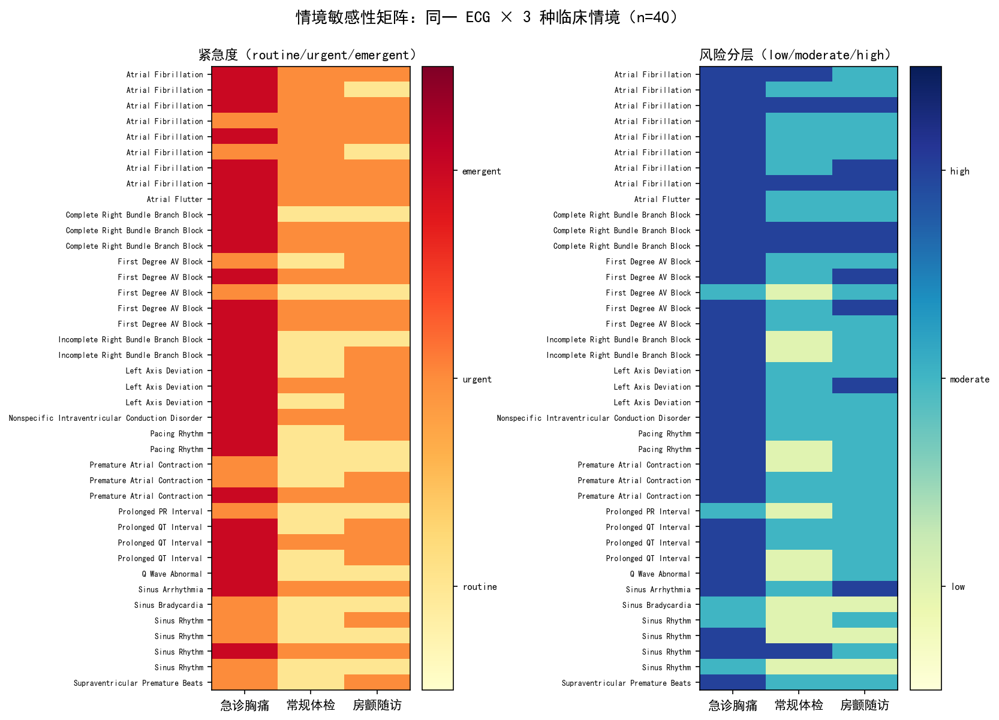

# 情境条件化的心电图智能诊断 Agent：双层输出架构与分级可信知识锚定

> **工作论文骨架 v0.2**（2026-08-30，三臂重跑轮次数字）
> 目标投稿：AAAI Student Abstract / BIBM / ML4H 梯队
> 全部数字来自 `ecg-ai-agent/outputs/` 下的可复现实验（素材清单见文末附录 A）

---

## 摘要（草稿）

心电图（ECG）自动诊断已进入"基础模型 + 大语言模型（LLM）"阶段，但现有工作存在三个缺口：① LLM 直接生成诊断缺乏对测量工具输出的锚定，存在幻觉风险；② 患者临床情境（就诊场景、主诉、病史）与波形发现被混为一谈，缺少"情境影响决策而非发现"的架构约束；③ 缺乏分级可信的医学知识底座，LLM 的鉴别诊断与建议无依据可循。
本文提出一个情境条件化 ECG 诊断 Agent 框架：以冻结的 ECGFounder 基础模型（macro AUC 0.9456，官方 PhysioNet 2020 评分类，患者级划分）作为波形发现层，确定性工具（R峰/HRV/QT）提供数值证据，DeepSeek LLM 负责规划、自反思与报告生成；报告严格遵循双层结构——发现层情境无关、风险与建议层情境条件化；并引入"采集→分级（A/B/C）→LLM 提炼→编译"的医学知识库子系统（官方 27 类全覆盖，每类 1-13 来源）作为检索锚定。
在 130 条 ECG × 5 维评测上，Agent 实现注入错误纠错 7/7（对照组标记率 4.1%）、数值声明幻觉率 1.2%（8 类数值模式口径，497 条声明中 6 条未锚定）、Top-5 发现准确率 93.1%；在 40 条 × 3 情境的情境敏感性基准上，发现层无越界编造 100%（570/570 条 findings 限于分类器阳性；严格集合一致性 77.5%，差异为采样温度下的选取子集波动）、紧急度单调性违例 0、情境敏感性 97.5%。结果表明：将"测量/发现"与"推理/决策"分层并以工具与分级知识双重锚定 LLM，可在不牺牲可靠性的前提下实现情境感知。

## 1. Introduction

### 1.1 背景与动机
- ECG 是心血管诊断第一线；深度学习已接近专家水平（PhysioNet/CinC 2020 等基准）
- LLM 医学应用三痛点：幻觉、工具链断裂、静态提示词
- 临床现实：**同一份房颤 ECG，在 25 岁体检与 75 岁急诊胸痛患者身上意味着完全不同的临床决策**（CHA₂DS₂-VASc 逻辑）

### 1.2 现有工作的缺口（贡献定位）
| 缺口 | 现有工作现状 | 本文做法 |
|------|------------|---------|
| 幻觉 | ECG-Chat/GEM 等直接生成，无测量锚定 | 工具输出锚定 + 特征摘要（不给 LLM 原始波形） |
| 情境 | 多数把情境混入单层输出 | **双层架构**：发现层情境无关（无越界编造 100%，严格一致性 77.5%）vs 决策层情境条件化（敏感性 97.5%，39/40） |
| 知识 | 依赖 LLM 参数记忆 | **分级可信知识库**（官方 27 类全覆盖，A/B/C 等级，逐条引用） |
| 评测 | 分类精度单一维度 | 五维 Agent 评测 + 情境敏感性基准（新基准） |

### 1.3 贡献（拟）
1. 情境条件化双层 ECG Agent 框架（发现/决策分离，含防泄漏设计）
2. **情境敏感性基准**：同一波形 × 多情境的决策变化矩阵（据检索为现有 benchmark 未覆盖维度）
3. 分级可信医学知识库流水线（爬取→分级→提炼→编译→检索锚定），官方 27 类全覆盖
4. 系统评测：五维 Agent 指标 + 从零训练 vs 基础模型的实证曲线（0.59→0.94）

## 2. Related Work
- ECG 深度学习与基础模型：xResNet1D-101（CinC2020 冠军）、ECGFounder（NEJM AI 2025, 10M+）、ECG-FM、torch_ecg
- ECG 多模态 LLM / Agent：ECG-Chat、ECG-QA、GEM、ECG-Expert-QA（BIBM 2025）、ECG-Agent（工具调用）、Cardiologent（多智能体）、CARE-ECG（因果推理）
- 医学知识增强：RAG in medicine、知识分级与溯源
- **差异点**：上述工作未见"发现/决策双层情境约束 + 情境敏感性基准"组合（M3 实验支撑）

## 3. Methods

### 3.1 数据与预处理
- PhysioNet/CinC 2020：43,101 条 12 导联原始记录（6 数据源：CPSC2018/CPSC2018-Extra/Georgia/PTB/PTB-XL/INCART）；采用官方评分集 `dx_mapping_scored.csv` 的 **27 个评分类**（节律/传导/形态/轴/间期/起搏），含官方评分类标签的记录 37,749 条进入训练与评测（无评分类标签的记录不参与，与官方评分口径一致）
- 预处理（ECGFounder 官方协议）：50Hz 陷波(Q30)→Butterworth 4阶[0.67,40]→0.4s 中值去基线→resample 500Hz→居中裁剪/零填充至 5000→全信号 z-score；导联顺序校验
- 划分：**患者级 80/10/10**（train 30,232 / val 3,763 / test 3,754；PTB-XL 按官方 patient_id、其余源按记录归患者，患者不跨划分）；防泄漏红线（测试集文本/报告不进入训练与推理；对比预训练只读 train 集）

### 3.2 发现层：ECGFounder 冻结特征 + MLP 头
- 冻结 1024 维特征 + 2 层 MLP → 27 类；逐类 Youden 阈值；Bootstrap 95% CI
- 对比基线：从零训练 InceptionTime/xResNet/ECG Transformer/SimCLR/集成（0.59→0.85 历史曲线，旧标签体系，见 §4.1 注²）

### 3.3 情境建模（公平实验，M1）
- 信号-文本 CLIP 预训练（文本仅作预训练监督，推理纯信号）；六变体消融（含临床元数据 age/sex vs 数据源 one-hot）
- 诚实负结果：年龄/性别对 27 类波形分类无增益（C2=0.9445 < A=0.9456）；数据源 one-hot 增益不可作为临床情境声称

### 3.4 Agent 框架（M2）
- ReAct 结构：Planner（JSON 计划）→ 确定性工具执行（R峰/HRV/QT/ECGFounder 分类）→ 规则+LLM 双层反射 → 结构化报告
- **实现口径（4A-RED-2 声明）**：五维评测由独立评测 harness 执行——规划/反射/报告经 LLM 直调（温度 0.3 采样），工具为确定性直调；`src/agent` 的 ReAct 框架类（Planner/Memory/Reflector/Registry/Scheduler）为交互演示用实现，未参与评测数字，本文不以框架类实现细节作主张
- 防幻觉设计：LLM 只见特征摘要；报告强制 7 节结构、逐节引用工具输出、无数据写"未测量"
- 评测集：130 条（27 类全覆盖、黄金工具计划、3 情境卡，患者级划分）

### 3.5 医学知识库子系统（K 阶段）
- 流水线：来源注册表（A指南/B同行评审/C教育资源）→ 采集（PubMed E-utilities + ECGpedia MediaWiki API + LITFL ECG Library）→ LLM 结构化提炼（防幻觉约束+重试+缓存）→ 编译（master + 官方 27 类，逐条 [来源,等级] 引用）
- 规模：全库覆盖 27 类（每类 1-13 来源；ECG 特征条目 2-48 条/类）
- 使用：报告生成时按分类器阳性诊断检索注入（`--use-kb` 分支）

### 3.6 双层输出与情境注入（M3）
- 输出结构：`{findings（情境无关，仅从分类器阳性选取）, risk_assessment（情境条件化）, recommendations（情境条件化）}`
- 情境卡：年龄/性别/就诊场景/主诉/病史；urgency 提示字段不注入 LLM（防泄漏答案）
- 共识硬规则：urgency(急诊) ≥ urgency(体检)；严重疾病急诊 ≥ urgent

## 4. Experiments

### 4.1 发现层：分类成绩单（test, n=3,754，官方 27 评分类，患者级划分）
| 模型 | macro AUC | Top-5 | 说明 |
|------|:---:|:---:|------|
| InceptionTime | 0.590² | — | 从零训练（历史，旧标签体系） |
| xResNet1D-101 | 0.791² | 92.7% | 从零训练（历史，旧标签体系） |
| ECG Transformer | 0.808² | 92.8% | 从零训练（历史，旧标签体系） |
| SimCLR xResNet | 0.841¹² | 95.3% | 自监督预训练（历史对照） |
| 3 模型集成 | 0.850² | 94.8% | 概率平均（历史，旧标签体系） |
| ECGFounder 线性探针 | 0.905² | — | 冻结特征（历史，旧标签体系） |
| **ECGFounder + MLP** | **0.9456** | **97.66%** | CI [0.939,0.952]（官方评分类，患者级划分） |
| 公平变体 C（+数据源） | 0.9592 | 98.45% | 数据源 one-hot（不作临床声称） |
| 公平变体 D（CLIP+数据源） | 0.9655 | 98.85% | 同上 |

> ¹ SimCLR 行基于旧实现（InfoNCE 正样本对泄漏进负样本集、对比预训练包含 val/test 信号），数字为 NPU 环境历史结果；实现已修复（见附录 B），受限于本机 CPU 环境未全量重跑，该行仅作历史对照、不作任何结论依据。
> ² 历史行训练于旧自定义 27 类标签体系（与官方评分类标签空间不同，不可直接比较）；本版发现层统一采用官方 `dx_mapping_scored.csv` 评分类（见 §3.1），历史行仅作工程演进参考。

### 4.2 多模态公平消融（M1.3，官方评分类，患者级划分）
| 变体 | macro AUC | 结论 |
|------|:---:|------|
| A ECG→MLP | 0.9456 | 基线 |
| B CLIP-ECG→MLP | 0.9486 | 512 维投影无显著增益（+0.3pp，CI 重叠） |
| C2 ECG+年龄性别 | 0.9445 | **年龄/性别对波形分类无增益**（负结果，C2<A 保持） |
| D2 CLIP+年龄性别 | 0.9468 | 与 A 无显著差异（+0.1pp，CI 重叠，不作增益结论） |

> ³ 消融数字取官方评分类患者级划分重跑版（`outputs/multimodal_fair/metrics.json`）；同目录旧标签体系产物 `metrics_v3_step3.json`（D2=0.9203 > A=0.9192）为历史版本，两版标签空间不同、结论以本版为准（2G 口径注记）。患者级重划分后 A 变体 0.9448→0.9456；C2<A 负结果保持，D2 与 A 差 0.12pp（CI 重叠），年龄/性别维度维持"无显著增益"诚实表述。

### 4.3 Agent 五维评测（130 条，DeepSeek-chat，官方评分类，患者级划分；2026-08-30 重跑轮次）
| 维度 | 结果 |
|------|------|
| 工具选择 | P=0.6127 / R=1.000 / 完全匹配 6/130（黄金计划为最小必需集；规划器倾向全量调用——高召回但存在过度规划，R=1.000 非"零漏选"，5J 审查修正措辞） |
| 注入错误纠错 | **7/7 捕获**：报告显式标记"快/慢节律诊断 vs 实测心率"冲突；未注入对照组同口径标记率 **4.07%**（5/123，均为真实工具输出不一致） |
| 幻觉率 | **1.21%**（6/497 条数值声明未锚定工具输出；口径覆盖 8 类数值模式、排除规范性范围/百分比/参考值/疾病一般知识表述，见 §4.6） |
| 发现层 Top-5 | 93.08%（121/130，注入前快照口径，不受错误注入污染） |
| Rubric 报告质量（三维） | 总分 3.37：正确性 3.12 / 完整性 2.87 / 依据性 4.20 |

> 口径说明：注入纠错采用"报告显式冲突标记 + 未注入对照组"判别力口径；Top-5 用注入前快照；判官失败不计分（judge_failures 单列）。三臂对照见下方（三臂同注入策略同评估集，患者级划分）。幻觉率从旧轮次 0.0% 变为 1.21% 属口径变化——检测从 5 类扩展为 8 类数值模式（新增 PR间期/QRS时限/电轴，工具无这些测量、声明即计）并修复两处误报（跨行匹配、疾病一般知识），非 LLM 行为劣化。

三臂对照（信号 / +医生报告 / +知识库，统一 rubric 判官，官方评分类，患者级划分；2026-08-30 重跑轮次）：rubric 总分 3.37 / 3.38 / 3.18（正确性 3.12/3.14/2.85、完整性 2.87/2.88/2.82、依据性 4.20/4.19/4.11）。**口径警示**：① report_arm 注入的医生原始报告与判官 GT 同源，其正确性为泄漏上界（第二次审查 🔴2E-1），不作"报告辅助更优"结论（report 仅 +0.01，判官噪声内）；② 三臂注入已对齐（各 7 条同策略注入记录，R2 修复 🔴2E-3）；③ 幻觉维度三臂分别为 1.21% / 0.99% / 1.35%（见 §4.6）。依据性三臂均最高——工具锚定被独立验证。kb_arm 采用**全 27 类目录注入**（总论方法论 + 分类器阳性诊断详情 + 全部类目压缩目录，2026-08-28 起）：LLM 可对照所有类别的判定标准验证/质疑分类器判断（鉴别与漏报核查），而非只看到阳性诊断的资料。

### 4.4 情境敏感性基准（M3，40 条 × 3 情境，官方评分类，患者级划分；2026-08-30 三臂重跑轮次）
| 指标 | 结果 |
|------|------|
| 发现层一致性（严格：三情境 findings 集合相等） | 77.5%（31/40；口径说明见下） |
| 发现层无越界编造 | **100%**（570/570 条 findings 全部限于分类器阳性——更强的"无情境污染"保证） |
| 发现层与 GT 平均重合率 | 89.3%（分母含全部 valid 情境，空 findings 计 0） |
| 紧急度单调性违例 | **0** |
| 严重疾病急诊紧急度 | **100%**（15/15 ≥urgent） |
| 情境敏感性（紧急度变化） | 97.5%（39/40） |
| 风险分层变化 | 90.0% |

> **一致性口径修正（2026-08-30）**：旧版"发现层一致性 100%"是早期轮次 LLM 恰好一致的观测。本轮重跑实测 77.5%——9 条记录的差异全部是 LLM 从分类器阳性列表中**选取子集不同**（采样温度 0.3 的非确定性，如 ed 情境列 5 项阳性、其余情境列 6 项），**零越界编造**（570/570 限于分类器阳性）。即：发现层内容始终锚定分类器阳性、无情境污染，但"选取哪些阳性列出"存在采样波动——论文以"无越界编造 100%"作为零情境污染的强保证，"严格一致性 77.5%"如实报告采样波动。

### 4.5 外部验证（M4，患者级划分）
**跨源分解（test, n=3,754，官方评分类 per-source macro AUC，患者级划分）**：
| 数据源 | n | macro AUC | 95% CI |
|------|---:|:---:|------|
| CPSC2018 | 516 | 0.973 | [0.963, 0.982] |
| CPSC2018-Extra | 131 | 0.791 | [0.753, 0.880] |
| Georgia | 946 | 0.908 | [0.899, 0.937] |
| PTB | 7 | 1.000 | [1.000, 1.000] |
| PTB-XL | 2152 | 0.939 | [0.919, 0.954] |
| INCART | 2 | 0.500 | [0.500, 0.500] |
| **总体** | **3754** | **0.9456** | **[0.939, 0.952]** |

> 注：n 为官方评分类标签非空的记录数（无评分类标签记录不参与评分，与官方口径一致）；患者级划分（PTB-XL 按官方 patient_id、其余源按记录归患者，train 30,232/val 3,763/test 3,754，患者不跨划分）；PTB/INCART 样本极小，其行仅作参考。

**MIMIC-IV-ECG 零样本域分析（n=500 vs CinC 对照 500，150 类原始头，患者级划分后 CinC 对照重采）**：
| 指标 | MIMIC | CinC | 解读 |
|------|:---:|:---:|------|
| mean max prob | 0.9970 | 0.9977 | 分布级行为高度一致（跨医院/年代迁移稳定） |
| mean entropy | 3.402 | 3.389 | 同上 |
| mean 阳性任务数 | 5.51 | 5.21 | MIMIC 略多（ICU/急诊人群更重） |
| Top-1 任务 | ABNORMAL ECG (229) | ABNORMAL ECG (221) | 一致 |
| 窦性心动过速 | 15 | 6 | MIMIC 略多（临床人群差异，符合预期） |
| 平导联比例 | 0.002 | 0.014 | MIMIC 诊断级数据干净（0 全平） |

> **MIMIC 表注（2026-08-30）**：本表数字来自历史产物 `mimic_domain.json`；其中"平导联比例"两列是 z-score 归一化后的统计（幅度信息已抹除，0.002/0.014 无信息量）——代码已修复为 MIMIC 侧在 z-score 前计算平导联（4H 审查），但重跑需 MIMIC-IV 数据目录（D:\ecg，本机不可用）。该行仅作数据质量印象参考，不作结论依据。

**逐类 AUC 与混淆模式**（详见 `per_class_auc.json`，患者级划分）：
- 最强类：Sinus Tachycardia 0.995、Bradycardia 0.990、LAFB 0.988、CRBBB 0.987；最难类：NSIVCB 0.830（n=80）、T Wave Inversion 0.857（n=118）、PVC 0.883（n=23）
- **主要误差模式**：窦性心律 ↔ T 波/间期类互混（Sinus Rhythm→T Wave Inversion 110、→T Wave Abnormal 79、→Premature Ventricular Contractions 74、→Prolonged QT 61、→Left Axis Deviation 60）——形态/间期类（T 波、QT、轴）是主要难点，与标签主观性及稀有类长尾一致

### 4.6 知识库质量
- 规模与覆盖：官方 27 类全覆盖（每类 1-13 来源：PubMed 摘要 + ECGpedia + LITFL ECG Library 按诊断页；ECG 特征 2-48 条/类）；总论知识编译入库。**4J-RED-2 修正**：旧稿"每类 7-13 来源、LAFB 最少 7 来源"与编译产物不符（实测 n_sources 1-13，LAFB 2 来源、Sinus Arrhythmia 1 来源），已按 classes.json 实际口径更正
- 三臂幻觉对比（2026-08-30 重跑轮次：main 6/497=1.21%、report 5/506=0.99%、kb 9/665=1.35%，患者级划分）：kb 臂在全部 27 类目录注入下数值声明最多（665 条）且幻觉率与主臂同量级——知识引导的"对照验证"不引入编造。**口径说明**：声明检测覆盖 8 类数值模式（心率/HR/QTc/QT/SDNN/PR间期/QRS时限/电轴；PR/QRS/电轴工具无测量、声明即幻觉），分子分母同口径（幻觉率恒 ∈[0,1]）；排除规范性范围/百分比表述（如"心率 60–100 bpm"、"预测最大心率 80%"）、知识库参考统计值（如"男性平均 QTc 422 ms"）与疾病一般知识表述（如"房扑常表现为心率 150 bpm 左右"，2026-08-30 误报修正）。**幻觉率从旧轮次 0.0% 变为 ~1% 属口径变化**：检测从 5 类扩展为 8 类（新增 PR/QRS/电轴三类"工具未测量即声明"），非 LLM 行为劣化；剩余幻觉主体为电轴数值声明（工具无电轴测量，报告 prompt 已要求"未测量"但 LLM 仍给出度数）。**KB 方向把关（4I-RED-1）**：编译端对方向敏感类（LBBB/RBBB/CRBBB、LAD/RAD、LAFB）做方向序列门 + 条目级过滤，消除对侧判据交叉污染（旧版 RBBB 判据 rsR' 曾混入 LBBB/LAFB）；§4.6 规模数字为方向把关重编译后的口径
- 已知改进项：定义字段偏好综述来源；爬取去重与空文本过滤；LITFL 页面需代理/浏览器头过 Cloudflare，部分类复用覆盖性页面（T 波倒置←T wave 页、SVPB←PAC 页）；本地 ptbxl_database.csv 缺 38 行（train 36/test 2 条记录无报告文本，report_arm 对这几条退化为无报告）

## 5. Discussion & Limitations（诚实清单）
1. 无医生盲评（作者团队无医学资源）；报告质量依赖 rubric LLM-judge（含噪声，三维分解缓解）
2. KB 定义字段可能取自临床试验摘要（改进：偏好综述）；LITFL 已解封补源（27/27 类，需代理/浏览器头过 Cloudflare），Utah 因 CC BY-ND-NC 禁止演绎弃用
3. 数据源 one-hot 增益不作临床情境声称（数据集成员信号）
4. 54 条记录 8-9s 零填充（train 45/val 6/test 3，segment_to_5000 居中零填充）；LAFB 等小众类来源数偏低（LAFB 2 来源，见 §4.6）
5. 三臂 rubric（3.37/3.38/3.18，2026-08-30 重跑）：report 臂正确性为 GT 泄漏上界、幻觉维度三臂 1.21%/0.99%/1.35%（8 类声明口径，见 §4.6）——分支价值需更细粒度指标（checklist 维度，未来工作）；KB 内容整改（定义相关性/占位符过滤/词边界/总论相关性/方向把关）已完成
6. 情境卡为模板构造，非真实 EHR；MIMIC-IV 关联留待后续
7. 成绩单中 SimCLR 行（0.841）的历史实现存在训练目标缺陷（正样本对泄漏进负集）与划分泄漏（预训练含 val/test），代码已修复但未全量重跑（原 NPU 环境不可用）；本文结论不依赖该行
8. 划分为患者级（PTB-XL 按官方 patient_id、其余源按记录归患者，患者不跨 train/val/test；记录级划分的早期版本存在 536 名患者跨 train/test 的泄漏，本版已修复）；患者级划分后总体 AUC 0.9456（记录级 0.9448，差异在 CI 内）
9. 标签体系：本版采用官方 dx_mapping_scored.csv 27 评分类并整体重贴标签/重训/重评（替代早期自定义体系，后者存在码-名错配）；无评分类标签的记录（如纯心梗/缺血）不参与评分，与官方口径一致
10. 成绩单历史行（0.590/0.791/0.808/0.841/0.850/0.905）来自旧标签体系与 NPU 环境，其中 0.850 集成在磁盘无完整产物；均仅作工程演进参考，不作结论依据

## 6. Conclusion
- 双层架构 + 工具/知识双重锚定实现了"可靠的情境感知"：发现层无越界编造 100%（严格一致性 77.5%，采样波动）、决策层 97.5% 敏感、数值声明幻觉率 1.2%（8 类口径，官方 27 评分类，患者级划分）
- 情境敏感性基准可推广到其他生理信号 Agent 评测

---

## 7. 投稿策略（梯队）

| 梯队 | 目标 | 时机 | 策略 |
|------|------|------|------|
| T1 保底 | ML4H (NeurIPS workshop) / EMBC | 先投，验证评审反馈 | 短篇版：情境基准 + 五维评测 |
| T2 主攻 | BIBM / AAAI Student Abstract | T1 反馈后改投 | 完整版：框架 + 知识库 + 双层架构 |
| T3 冲刺 | AAAI/WWW 正刊（学生一作） | 视 T2 结果 | 需补：MIMIC 有监督验证 + checklist 判官 |

- 双版本策略：**短篇（4 页，情境敏感性基准+五维评测）** 与 **长版（框架全貌）** 复用同一套实验素材
- 每轮投稿前核对附录 A 的 claim→复现路径，确保全部可复现

---

## 附录 A：论文素材清单（claim → 复现路径）
| 声称 | 复现命令 | 产物 |
|------|---------|------|
| 分类成绩单 | `python scripts/train_ecgfounder_head.py --with-linear-probe` | `outputs/ecgfounder_mlp/metrics.json` |
| 六变体公平消融 | `python scripts/train_multimodal_fair.py` | `outputs/multimodal_fair/metrics.json` |
| CLIP 预训练 | `python scripts/train_ecg_text_clip.py` | `outputs/clip_pretrained/meta.json` |
| Agent 五维 | `python scripts/eval_agent_llm.py`（main/report/kb 三臂） | `outputs/agent_eval/metrics_*.json` |
| Rubric 重打分 | `python scripts/rejudge_with_rubric.py` | `outputs/agent_eval/judge_rubric_results.json` |
| 情境敏感性 | `python scripts/eval_agent_context.py --evalset outputs/context_eval/context_subset.json` | `outputs/context_eval/metrics.json` |
| 知识库 | `crawl_knowledge.py → distill_knowledge.py → compile_knowledge.py` | `data/knowledge/kb/` |
| 评估集 | `python scripts/build_agent_evalset.py` | `outputs/agent_evalset/evalset.json` |
| 数据预处理 | `python scripts/preprocess_data_5k.py` | `data/physionet2020/processed_5k/` |

## 附录 B：待办（收尾后进入细修阶段）
- [x] 填充 M4 数字（跨源/逐类/MIMIC 域分析）
- [x] 图表：成绩单曲线、五维雷达图、情境敏感性矩阵、KB 流水线图（2026-08-30 三臂重跑后重生成）
- [x] Related Work 精读 12 篇对比表（`related_work.md`，含 2 处 arXiv ID 勘误）
- [x] 投稿策略定稿（T1 ML4H/EMBC → T2 BIBM/AAAI Student → T3 正刊）
- [x] 五轮代码审查 + 四轮定向复查 + 三臂重跑（deepseek-chat）+ 论文数字全部同步（2026-08-30）
- [ ] 摘要按投稿模板再润色（各会议模板不同，投稿前适配）
- [ ] 图表字号/配色按目标会议模板微调
- [ ] 正文从 Markdown 转 LaTeX（投稿前）
- [ ] （可选）MIMIC 有监督外部验证：核实 mimic-iv-ecg-ext-icd-labels 许可后补充（含 MIMIC 域分析重跑——平导联统计代码已修复，待数据目录可用）
- [ ] （可选）合成噪声鲁棒性曲线（MIMIC 数据过干净，质量-置信度分析未触发）
- [ ] （可选）checklist 判官（鉴别诊断覆盖/指南依据维度）
